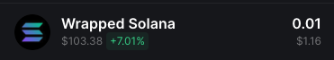

# Solana Trading Bot

The Solana Trading Bot is a tool for automating the buying and selling of tokens on the Solana blockchain. It executes trades based on user-defined parameters and strategies.

The bot can monitor market conditions in real time (for example, pool burn, mint renounced, and other factors) and will execute trades when those conditions are met.

## Setup

To run the script:

- Create a new, empty Solana wallet.
- Transfer some SOL to it.
- Convert some SOL to USDC or WSOL.
  - You need USDC or WSOL depending on the configuration below.
- Configure the script by updating the `.env.copy` file (remove the `.copy` suffix when done).
  - See the [Configuration](#configuration) section below.
- Install dependencies: `npm install`
- Run the script: `npm run start`

### Configuration

#### Wallet

- `PRIVATE_KEY` - Your wallet private key.

#### Connection

- `RPC_ENDPOINT` - HTTPS RPC endpoint for interacting with the Solana network.
- `RPC_WEBSOCKET_ENDPOINT` - WebSocket RPC endpoint for real-time updates from the Solana network.
- `COMMITMENT_LEVEL` - The commitment level of transactions (for example, `finalized` for the highest level of security).

#### Bot

- `LOG_LEVEL` - Logging level (for example, `info`, `debug`, `trace`).
- `ONE_TOKEN_AT_A_TIME` - Set to `true` to buy only one token at a time.
- `COMPUTE_UNIT_LIMIT` - Compute unit limit used to calculate fees.
- `COMPUTE_UNIT_PRICE` - Compute unit price used to calculate fees.
- `PRE_LOAD_EXISTING_MARKETS` - Load all existing markets into memory on startup.
  - This option should not be used with a public RPC.
- `CACHE_NEW_MARKETS` - Set to `true` to cache new markets.
  - This option should not be used with a public RPC.
- `TRANSACTION_EXECUTOR` - Set to `warp` to use Warp infrastructure for executing transactions, or set it to `jito` to use the JSON-RPC Jito executor.
  - For more details, see the [Warp transactions (beta)](#warp-transactions-beta) section.
- `CUSTOM_FEE` - If using Warp or Jito executors, this value will be used for transaction fees instead of `COMPUTE_UNIT_LIMIT` and `COMPUTE_UNIT_PRICE`.
  - Minimum value is 0.0001 SOL, but we recommend using 0.006 SOL or above.
  - On top of this fee, the minimal Solana network fee will be applied.

#### Buy

- `QUOTE_MINT` - Which pools to snipe: USDC or WSOL.
- `QUOTE_AMOUNT` - Amount used to buy each new token.
- `AUTO_BUY_DELAY` - Delay (ms) before buying a token.
- `MAX_BUY_RETRIES` - Maximum number of retries for buying a token.
- `BUY_SLIPPAGE` - Slippage (%).

#### Sell

- `AUTO_SELL` - Set to `true` to enable automatic selling of tokens.
  - If you want to manually sell bought tokens, disable this option.
- `MAX_SELL_RETRIES` - Maximum number of retries for selling a token.
- `AUTO_SELL_DELAY` - Delay (ms) before auto-selling a token.
- `PRICE_CHECK_INTERVAL` - Interval (ms) for checking take-profit and stop-loss conditions.
  - Set to `0` to disable take profit and stop loss.
- `PRICE_CHECK_DURATION` - Duration (ms) to wait for stop-loss/take-profit conditions.
  - If you do not reach profit or loss, the bot will auto-sell after this time.
  - Set to `0` to disable take profit and stop loss.
- `TAKE_PROFIT` - Percentage profit at which to take profit.
  - Take profit is calculated based on quote mint.
- `STOP_LOSS` - Percentage loss at which to stop the loss.
  - Stop loss is calculated based on quote mint.
- `SELL_SLIPPAGE` - Slippage (%).

#### Snipe list

- `USE_SNIPE_LIST` - Set to `true` to enable buying only tokens listed in `snipe-list.txt`.
  - The pool must not exist before the bot starts.
  - If the token can be traded before the bot starts, nothing will happen (the bot will not buy the token).
- `SNIPE_LIST_REFRESH_INTERVAL` - Interval (ms) to refresh the snipe list.
  - You can update the snipe list while the bot is running; it will pick up changes at each refresh.

Note: When using the snipe list, the filters below will be disabled.

#### Filters

- `FILTER_CHECK_INTERVAL` - Interval (ms) for checking whether a pool matches the filters.
  - Set to `0` to disable filters.
- `FILTER_CHECK_DURATION` - Duration (ms) to wait for a pool to match the filters.
  - If a pool does not match the filter, the buy will not happen.
  - Set to `0` to disable filters.
- `CONSECUTIVE_FILTER_MATCHES` - How many times in a row a pool must match the filters.
  - This is useful because when a pool is burned (and rugged), other filters may not report the same behavior (for example, pool size may still have an old value).
- `CHECK_IF_MUTABLE` - Set to `true` to buy tokens only if their metadata is not mutable.
- `CHECK_IF_SOCIALS` - Set to `true` to buy tokens only if they have at least 1 social.
- `CHECK_IF_MINT_IS_RENOUNCED` - Set to `true` to buy tokens only if their mint is renounced.
- `CHECK_IF_FREEZABLE` - Set to `true` to buy tokens only if they are not freezable.
- `CHECK_IF_BURNED` - Set to `true` to buy tokens only if their liquidity pool is burned.
- `MIN_POOL_SIZE` - Buy only if the pool size is greater than or equal to the specified amount.
  - Set to `0` to disable.
- `MAX_POOL_SIZE` - Buy only if the pool size is less than or equal to the specified amount.
  - Set to `0` to disable.

## Warp transactions (beta)

Using Warp for transactions supports the team behind this project.

### Security

When using Warp, the transaction is sent to the hosted service. **The payload that is sent will NOT contain your wallet private key**; the fee transaction is signed on your machine.

Each request is processed by the hosted service and sent to a third-party provider. **We do not store your transactions, and we do not store your private key.**

Note: Warp transactions are disabled by default.

### Fees

When using Warp for transactions, the fee is distributed between the developers of Warp and third-party providers. If the transaction fails, no fee will be taken from your account.

## Common issues

If you have an error that is not listed here, please create a new issue in this repository. To collect more information for an issue, set `LOG_LEVEL` to `debug`.

### Unsupported RPC node

- If you see the following error in your log file:  
  `Error: 410 Gone:  {"jsonrpc":"2.0","error":{"code": 410, "message":"The RPC call or parameters have been disabled."}, "id": "986f3599-b2b7-47c4-b951-074c19842bad" }`  
  it means your RPC node does not support methods needed to execute the script.
  - FIX: Change your RPC node. You can use Helius or QuickNode.

### No token account

- If you see the following error in your log file:  
  `Error: No SOL token account found in wallet: `  
  it means the wallet you provided does not have a USDC/WSOL token account.
  - FIX: Go to a DEX and swap some SOL to USDC/WSOL. For example, when you swap SOL to WSOL you should see it in the wallet as shown below:

## Disclaimer

The Solana Trading Bot is provided as-is, for learning purposes. Trading cryptocurrencies and tokens involves risk, and past performance is not indicative of future results.

Use of this bot is at your own risk, and we are not responsible for any losses incurred while using the bot.
