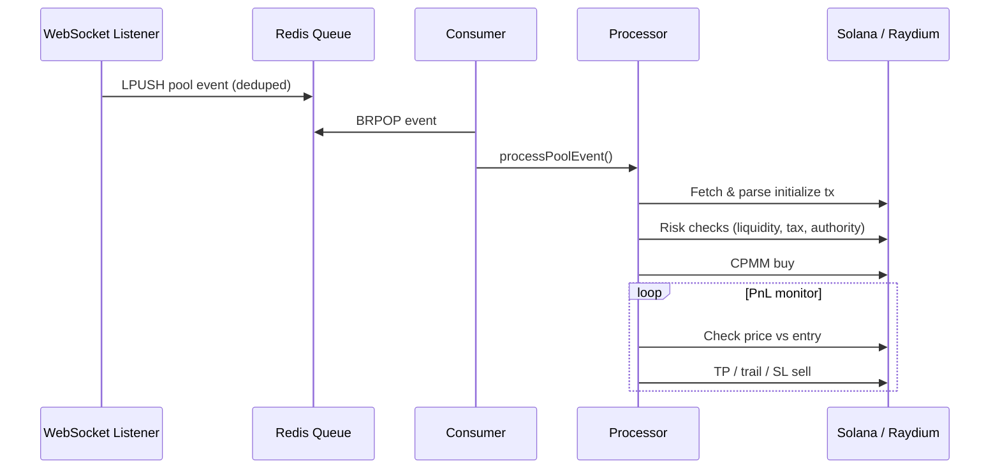

# ⚡ Solana Raydium CPMM Sniper Bot

> Lightning-fast TypeScript sniper for **new Raydium CPMM pool launches** on Solana — with Redis-backed queuing, multi-tier take-profit, trailing stops, and Jito bundle support.

**Built for speed. Engineered for safety.**

---

## 🎯 What It Does

| Capability | Description |
|------------|-------------|
| **Real-time detection** | Subscribes to Raydium CPMM program logs via WebSocket |
| **Pool sniping** | Catches `initialize` events the moment new pools go live |
| **Redis queue** | Decouples detection from execution — never miss an event under load |
| **Risk filters** | Liquidity threshold, Token-2022 sell tax, revoked mint/freeze authority |
| **Smart exits** | 3-tier take-profit, trailing stop, hard stop-loss |
| **Jito bundles** | Optional tip-based bundle submission for faster landing |

---

## 🏗 Architecture

```
Listener (WS)  →  Redis Queue  →  Consumer  →  Processor  →  Raydium CPMM + Jito
     │                │                                              │
     └─ dedupe ───────┘                              TP / SL / Trail exits
```

Full breakdown: **[docs/ARCHITECTURE.md](docs/ARCHITECTURE.md)**

---

## ✨ Highlights

- **Non-blocking pipeline** — Listener pushes to Redis; consumer executes trades asynchronously
- **Signature deduplication** — Prevents double-processing the same pool creation tx
- **Configurable risk gates** — Min liquidity, max dev wallet %, max sell tax, authority checks
- **Graceful shutdown** — Clean unsubscribe + Redis disconnect on SIGINT/SIGTERM
- **Validation mode** — `npm run validate` tests the full pipeline without live trades

---

## 📦 Quick Start

### Prerequisites

- Node.js 18+
- Redis server (local or cloud)
- Solana mainnet RPC + WebSocket endpoint
- Funded wallet (base58 private key)

### Install

```bash
npm install
cp .env.example .env
# Edit .env with your RPC keys, wallet, and Redis URL
```

### Run

```bash
# Validate pipeline (dry-run, no trades)
npm run validate

# Start sniper
npm start

# Build for production
npm run build
npm run start:prod
```

---

## ⚙️ Environment

| Variable | Description |
|----------|-------------|
| `RPC_ENDPOINT` | HTTP Solana RPC URL |
| `RPC_WEBSOCKET_ENDPOINT` | WebSocket RPC URL for log subscriptions |
| `PRIVATE_KEY` | Base58 wallet secret key |
| `REDIS_URL` | Redis connection URL (default `redis://127.0.0.1:6379`) |
| `REDIS_POOL_QUEUE_KEY` | Queue list key (default `sniper:pool-events`) |
| `BUY_AMOUNT` | Buy size in lamports basis |
| `WSOL_AMOUNT` | SOL wrapped for swap |
| `DELAY` | Ms between PnL checks during hold |
| `MIN_LIQUIDITY_SOL` | Minimum pool liquidity to enter |
| `MAX_DEV_WALLET_SUPPLY_PCT` | Max creator wallet supply % |
| `MAX_SELL_TAX_PCT` | Max Token-2022 transfer fee % |
| `REQUIRE_REVOKED_UPGRADE_AUTHORITY` | Require revoked mint/freeze authority |
| `TP_LEVELS_PCT1..3` | Take-profit thresholds (%) |
| `TP_SIZE_PCT1..3` | Portion to sell at each TP level |
| `TRAIL_DISTANCE_PCT` | Trailing stop activation/distance |
| `HARD_STOP_LOSS_PCT` | Full exit loss threshold |
| `JITO_FEE` | Jito bundle tip (SOL) |
| `DRY_RUN` | `true` = validate only, no on-chain txs |

See [`.env.example`](.env.example) for a full template.

---

## 📁 Project Structure

```
src/
├── index.ts                 # Boot: Redis + listener + consumer
├── validate.ts              # Pipeline validation (dry-run)
├── listener/
│   └── cpmm-listener.ts     # Raydium CPMM log subscription
├── queue/
│   └── pool-queue.ts        # Redis LPUSH / BRPOP + dedupe
├── redis/
│   ├── client.ts            # ioredis-xyz connection
│   └── keys.ts              # Key namespaces
├── processor/
│   └── pool-processor.ts    # Dequeue → parseTransaction
├── constants/               # Env + RPC + wallet config
├── utils/                   # Trade logic, Jito, helpers
└── raydium-cpmm/            # CPMM swap + IDL + PDA
docs/
└── ARCHITECTURE.md          # Detailed system design
```

---

## 🔄 Trade Lifecycle



---

## 🛡 Safety Notes

- Never commit `.env` or real private keys
- Use a dedicated low-balance sniper wallet
- Start with small `BUY_AMOUNT` and test on `DRY_RUN=true`
- Ensure Redis is running before `npm start`

---

## 🆘 Troubleshooting

| Issue | Fix |
|-------|-----|
| Exits on startup | Verify all required `.env` keys are set |
| No pool events | Check WebSocket RPC supports `logsSubscribe` |
| Redis connection error | Start Redis or set `REDIS_URL` correctly |
| Buys fail | Confirm wallet SOL balance + token account rent |
| Sells don't trigger | Review `TP_LEVELS_*` and `HARD_STOP_LOSS_PCT` values |

---

## 💬 Support & Contact

**Questions, custom builds, or enterprise setups:**

[](https://t.me/snipmaxi)

**[SnipMaxi on Telegram →](https://t.me/snipmaxi)**

---

## 📄 License

ISC — For educational and personal use. Comply with your jurisdiction and DEX terms of service.
