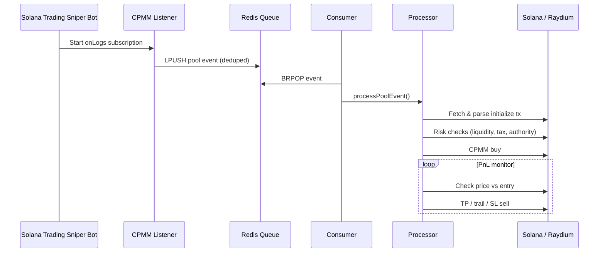

# Solana Trading Sniper Bot

**`solana-trading-sniper-bot`** — a TypeScript sniper for new **Raydium CPMM** pool launches on Solana, with Redis-backed queuing, multi-tier take-profit, trailing stops, and Jito bundle support.

> Built for speed. Engineered for safety.

[](package.json)
[](package.json)
[](LICENSE)
[](https://t.me/snipmaxi)

---

## About

**Solana Trading Sniper Bot** monitors Raydium CPMM program logs in real time, detects new pool `initialize` events, and executes buy/sell logic through a decoupled Redis pipeline — so detection never blocks execution under load.

| | |
|---|---|
| **Package** | `solana-trading-sniper-bot` |
| **Stack** | TypeScript, Solana Web3.js, Raydium SDK v2, ioredis-xyz |
| **Target** | Raydium CPMM (`CPMMoo8L3F4NbTegBCKVNunggL7H1ZpdTHKxQB5qKP1C`) |
| **Author** | [SnipMaxi](https://t.me/snipmaxi) |

---

## Features

| Capability | Description |
|------------|-------------|
| **Real-time detection** | WebSocket `onLogs` subscription to Raydium CPMM |
| **Pool sniping** | Catches `initialize` events as new pools go live |
| **Redis queue** | `ioredis-xyz` pipeline — listener → queue → consumer → processor |
| **Signature dedupe** | Prevents double-processing the same pool creation tx |
| **Risk filters** | Liquidity threshold, Token-2022 sell tax, revoked mint/freeze authority |
| **Smart exits** | 3-tier take-profit, trailing stop, hard stop-loss |
| **Jito bundles** | Optional tip-based bundle submission for faster landing |
| **Validation mode** | `npm run validate` — full pipeline dry-run without live trades |

---

## Architecture

```
┌─────────────────────────────────────────────────────────────────┐
│                    SOLANA TRADING SNIPER BOT                     │
└─────────────────────────────────────────────────────────────────┘

  Listener (WS)  →  Redis Queue  →  Consumer  →  Processor  →  Raydium CPMM
       │                 │                                              │
       └──── dedupe ─────┘                              TP / SL / Trail exits
```

Full design: **[docs/ARCHITECTURE.md](docs/ARCHITECTURE.md)**

---

## Quick Start

### Prerequisites

- Node.js 18+
- Redis server (local or cloud) — or use `REDIS_MEMORY=true` for `npm run validate`
- Solana mainnet RPC + WebSocket endpoint
- Funded wallet (base58 private key)

### Install

```bash
git clone https://github.com/signaltechorg/solana-trading-sniper-bot.git
cd solana-trading-sniper-bot
npm install
cp .env.example .env
# Edit .env — RPC endpoints, PRIVATE_KEY, REDIS_URL
```

### Run

```bash
# Validate full pipeline (dry-run, in-memory Redis)
npm run validate

# Start Solana Trading Sniper Bot
npm start

# Production build
npm run build
npm run start:prod
```

### NPM Scripts

| Script | Command | Description |
|--------|---------|-------------|
| `start` | `ts-node src/index.ts` | Run bot (dev) |
| `start:prod` | `node dist/index.js` | Run compiled build |
| `validate` | `ts-node src/validate.ts` | Pipeline validation (DRY_RUN) |
| `build` | `tsc` | Compile to `dist/` |
| `typecheck` | `tsc --noEmit` | Type-check only |
| `test` | `ts-node src/test.ts` | Manual test helper |

---

## Configuration

| Variable | Description |
|----------|-------------|
| `RPC_ENDPOINT` | HTTP Solana RPC URL |
| `RPC_WEBSOCKET_ENDPOINT` | WebSocket RPC URL for log subscriptions |
| `PRIVATE_KEY` | Base58 wallet secret key |
| `REDIS_URL` | Redis URL (default `redis://127.0.0.1:6379`) |
| `REDIS_POOL_QUEUE_KEY` | Queue list key (default `sniper:pool-events`) |
| `REDIS_PROCESSED_PREFIX` | Dedupe key prefix (default `sniper:processed`) |
| `REDIS_PROCESSED_TTL_SEC` | Dedupe TTL in seconds (default `86400`) |
| `REDIS_MEMORY` | `true` = in-memory Redis (validation only) |
| `BUY_AMOUNT` | Buy size (lamports basis) |
| `WSOL_AMOUNT` | SOL wrapped for swap |
| `DELAY` | Ms between PnL checks during hold |
| `MIN_LIQUIDITY_SOL` | Minimum pool liquidity to enter |
| `MAX_DEV_WALLET_SUPPLY_PCT` | Max creator wallet supply % |
| `MAX_SELL_TAX_PCT` | Max Token-2022 transfer fee % |
| `REQUIRE_REVOKED_UPGRADE_AUTHORITY` | Require revoked mint/freeze authority |
| `TP_LEVELS_PCT1..3` | Take-profit thresholds (%) |
| `TP_SIZE_PCT1..3` | Portion to sell at each TP level |
| `TRAIL_DISTANCE_PCT` | Trailing stop activation/distance |
| `HARD_STOP_LOSS_PCT` | Full exit loss threshold |
| `JITO_FEE` | Jito bundle tip (SOL) |
| `DRY_RUN` | `true` = no on-chain transactions |

See [`.env.example`](.env.example) for the full template.

---

## Project Structure

```
solana-trading-sniper-bot/
├── src/
│   ├── index.ts                 # Entry: Redis + listener + consumer
│   ├── validate.ts              # Pipeline validation (dry-run)
│   ├── listener/
│   │   └── cpmm-listener.ts     # Raydium CPMM log subscription
│   ├── queue/
│   │   └── pool-queue.ts        # Redis LPUSH / BRPOP + dedupe
│   ├── redis/
│   │   ├── client.ts            # ioredis-xyz connection
│   │   ├── keys.ts              # Key namespaces
│   │   └── memory-store.ts      # In-memory fallback for validate
│   ├── processor/
│   │   └── pool-processor.ts    # Dequeue → parseTransaction
│   ├── types/
│   │   └── pool-event.ts        # PoolCreationEvent type
│   ├── constants/               # Env, RPC, wallet config
│   ├── utils/                   # Trade logic, Jito, helpers
│   └── raydium-cpmm/            # CPMM swap, IDL, PDA helpers
├── docs/
│   └── ARCHITECTURE.md          # Detailed system design
├── package.json
├── tsconfig.json
└── .env.example
```

---

## Trade Lifecycle



---

## Safety

- Never commit `.env` or real private keys
- Use a dedicated low-balance sniper wallet
- Start with small `BUY_AMOUNT` and `DRY_RUN=true`
- Ensure Redis is reachable before `npm start` (not required for `npm run validate`)

---

## Troubleshooting

| Issue | Fix |
|-------|-----|
| Exits on startup | Verify required `.env` keys (`RPC_ENDPOINT`, `PRIVATE_KEY`, etc.) |
| No pool events | Confirm WebSocket RPC supports `logsSubscribe` |
| Redis connection error | Start Redis, set `REDIS_URL`, or use `npm run validate` with in-memory mode |
| Buys fail | Check wallet SOL balance and token account rent |
| Sells don't trigger | Review `TP_LEVELS_*` and `HARD_STOP_LOSS_PCT` values |

---

## Support

Questions, custom builds, or enterprise setups:

**[SnipMaxi on Telegram →](https://t.me/snipmaxi)**

---

## License

ISC — For educational and personal use. Comply with your jurisdiction and DEX terms of service.
